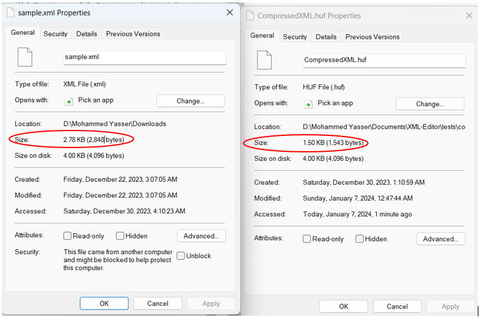
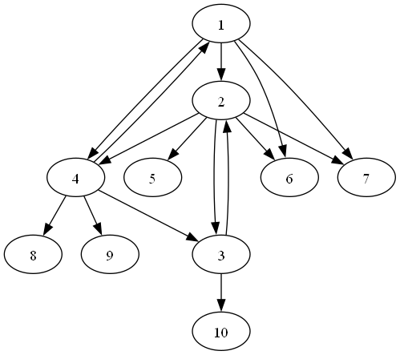

# XML-Editor

Language: C++

Brief explanation:

## Level 1

### GUI:

### Checking xml Consistency:
The program incorporates a robust XML consistency checking mechanism designed to ensure the correct structure of XML files. Utilizing a stack-based approach, it validates the structure of XML tags, identifying missing or mismatched opening and closing tags. The program not only identifies but also visually highlights errors, providing users with a clear indication of potential issues within their XML documents.

Error Visualization:
Inconsistencies in the XML file, such as missing or mismatched tags, are visually highlighted within the GUI, allowing users to identify and understand the errors.

Automatic Correction: The program offers a functionality to automatically correct detected errors in the XML file. Users can choose to apply corrections, and the corrected XML will be displayed within the GUI.


### Prettifying xml:
The xmlPrettifier function utilizes a line-by-line approach to analyze the input XML string. It adds proper indentation based on XML tags, enhancing readability. The function tracks the nesting level of XML elements, adjusting the indentation accordingly.

### Minifying xml:
The xmlMinifier function employs the remove-erase idiom to eliminate unnecessary whitespace from the input XML string. It traverses the string, identifying and removing spaces, tabs, and line breaks, except for newline characters essential for maintaining structure. This results in a minified XML string suitable for more compact representation and reduced file size.

### Inserting xml to Tree:
Function parseXML:

The function takes an XML string (xml) as input and returns a pointer to the root of the XML tree (Node*).It initializes pointers for the root (root) and the current node being processed (currentNode).The XML string is processed line by line using an istringstream.If a line contains a '<' character, it is considered a potential XML tag.If the tag starts with '/', it indicates the end of an element, and the tag value is set for the current node, and the current node is set to its parent.
If the line contains "</", it signifies the end of an element with a closing tag. A new node is created, and it is either added as a child to the current node or set as the root if there is no current node.If the line contains '>', it indicates the start of an element. A new node is created, its parent is set to the current node, and it is added as a child to the current node. The current node is then updated to the newly created node.
If none of the above conditions are met, it implies the start of a new element without a closing tag on the same line. A new node is created similarly to the case with '>', and the current node is updated.The function returns the root of the constructed XML tree.

Function extractTagName:
This function extracts the tag name from an XML line using a regular expression.It searches for the pattern <anything> and returns the content inside the brackets.

Function extractTagValue:
This function extracts the tag value for a given tag name from an XML line using a regular expression.It searches for the pattern <tagName>anything</tagName> and returns the content between the opening and closing tags.

Note: The code assumes that the XML is well-formed, and there is no error handling for cases where the XML might be invalid.
### Converting xml to json:
Function jsonFormat:
It takes three parameters: a pointer to a Node (node), an integer level indicating the current indentation level, and a reference to an integer flag.The function recursively processes the XML-like tree and builds a JSON-formatted string.It starts by checking if the flag is true (which indicates whether it's the first element at a particular level). If true, it adds the JSON key with the tag name.If the node has no children, it adds the JSON value corresponding to the tag value.
If the node has a single child, it opens a JSON object, recursively processes the child, and closes the object.If the node has multiple children, it checks if any children have the same tag name. If yes, it assumes an array structure and organizes the children accordingly. If no common tag name is found, it treats the children as separate objects.then the print_json function print the json string between curly brackets.
### Compressing the Data:
This feature aims to reduce the size of the XML file and store in a compacted .huf file.  
This compression technique follows a three-step process:
1. **XML to JSON Minified:** Converts the XML into JSON formart and minifies it using a special JSON minifier to remove whitespaces.
2.  **Key Compression:** All object keys are replaced with index of array stored at the end of the file. The More same key appears in the original JSON, the more better compression.
This technique is influenced by a technique used in the famous compressed-json package. [Compressed-json package](https://www.npmjs.com/package/compressed-json)
3. **Huffman Encodeing:** The previous 2 processes helped to reduce the XML format and field names, Huffman Encoding aimed to reduce the size taken by large texts in Tag values. This is a straight implementation of [Huffman Coding](https://en.wikipedia.org/wiki/Huffman_coding).

**Results:** When this compression techniques is applied on a small 2.78KB XML file it manages to reduce its size by approx. **54%**.


### Decompressing:
This feature just reverses the compression process by performing the following steps:  
1. **Huffman Decoding:** Retrieves the Huffman-encoded data.
2. **Key Decompression:** Reverts the compressed field names to their original form within the JSON structure.
3. **JSON to XML Conversion:** Converts the JSON content back to XML format.
## File Storage

### Saved Files Location

The XML Editor saves files to the following directory:

```
XML-Editor\GUIDS\x64\Debug\Saved files
```

All files saved through the GUI will be stored in this directory.

### Compression File Location

The compression files (with a `.huf` extension) are saved to the following directory:

```
XML-Editor\GUIDS
```

Make sure not to modify or delete any essential files in this directory to ensure proper functionality.
## Level 2

### Network Analysis:

### Graph:
## Network Visualization:
This feature allows you to visualize your network in a graph structure.
  
**NOTE** Make sure you have [GraphViz](https://graphviz.org/download/) downloaded and correctly added to PATH to be able to use this feature.
### Undo/Redo operations:
The program introduces Undo and Redo operations to enhance user flexibility. Users can easily revert to a previous state (Undo) or reapply operations (Redo), providing a dynamic and interactive experience.
